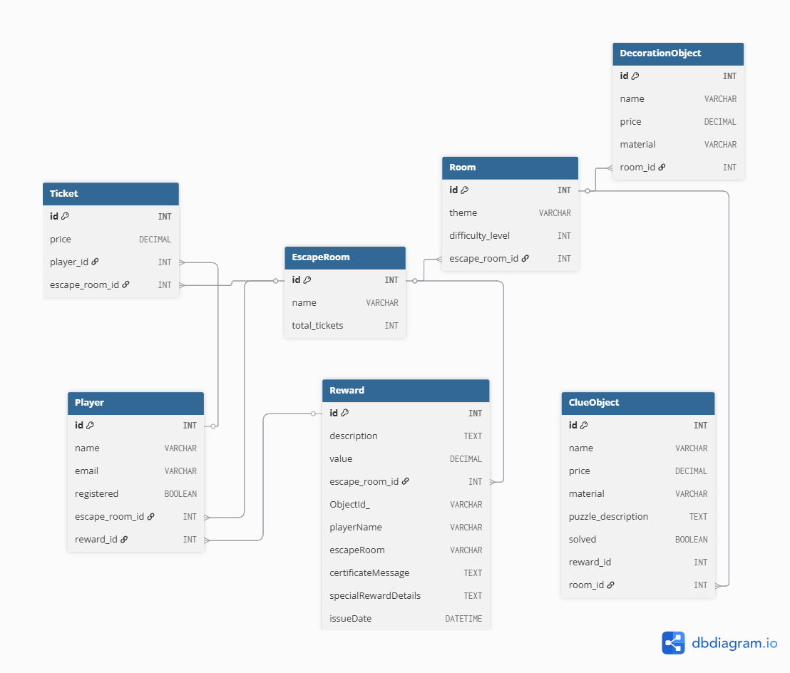

# S3.03 - Developers Team
# VIRTUAL SCAPE ROOM


### 👾 Authors
* [ArnauAsole](https://github.com/ArnauAsole)
* [anaberod](https://github.com/anaberod)
* [JavierDolo](https://github.com/JavierDolo)
* [Resikrys](https://github.com/Resikrys)

-----

## Summary

This exercise involves developing an application to manage a virtual Escape
Room. The application will allow the creation and management of themed rooms,
intriguing clueObjects, unique decoration items, and maintain an up-to-date inventory.
Additionally, functionalities for tracking income, and user notifications will
be implemented. Data persistence will be achieved using MySQL.

-----

## Escape Room Management System
This project is a console-based application designed to manage an escape room business, 
allowing for the creation and management of escape rooms, rooms within them, and various 
objects like clues and decorations, along with players and tickets.

## 🏗️ Architecture
The application follows a layered architecture with clear separation of concerns, 
promoting maintainability, testability, and flexibility. Each layer has distinct 
responsibilities:

- **Frontend Layer** - Handles user interaction and displays information.
- **DAO Layer** - Manages direct data access operations (Create, Read, Update, 
Delete).
- **DB Connection Layer** - Establishes and manages connections to the database.

### 💻 Frontend Layer
The frontend layer serves as the user interface for interacting with the system. 
It's a console-based application that provides various menus and prompts for 
user input.
### Key Components
- **Main Application Entry Point**: The primary class (e.g., `MainMenu`) that initiates 
the application, manages the overall flow, and presents the initial options to 
the user.
- **Input/Output Handling**: Classes responsible for displaying information to the 
console and reading user input.
- **User Interaction Flow**:
  - The application starts, typically presenting a main menu.
  - Users navigate through different options to manage `EscapeRooms`, `Rooms`, `ClueObjects`, 
  `DecorationObjects`, `Players`, and `Tickets`.
  - Each menu option typically corresponds to an operation (create, view, update, delete).
  - Input validation and error handling are present to guide the user.

### Frontend Features
- **Console-based UI**: Simple and direct interaction via text commands.
- **Menu-driven Navigation**: Users select actions from numbered lists.
- **Input Validation**: Ensures user input conforms to expected formats and constraints.

### 📊 DAO Layer
The Data Access Object (DAO) layer is responsible for all Create, Read, Update, 
and Delete (CRUD) operations for each entity. It acts as an abstraction layer 
over the underlying database, shielding the business logic from database-specific 
implementation details.

### Key Components
- **DAO Interfaces**: Define the contract for data access operations (e.g., `RoomDao`,
  `ClueDao`). These interfaces specify what operations can be performed on an 
entity without revealing how.
- **DAO Implementations**: Concrete classes that implement the DAO interfaces 
(e.g., `RoomDaoImplementation`, `ClueDAOImplementation`). These classes contain 
the actual SQL logic and database interaction code.

### Responsibilities
- **Data Persistence**: Saving new objects to the database.
- **Data Retrieval**: Fetching existing objects from the database by ID or as a list.
- **Data Modification**: Updating properties of existing objects in the database.
- **Data Deletion**: Removing objects from the database.
- **Exception Handling**: Translating low-level SQLExceptions into more 
meaningful application-specific exceptions (e.g., `NotFoundException`).

### DAO and DB Connection Interaction
The DAO layer utilizes the DB Connection layer to acquire database connections 
and execute SQL statements.

### DB Connection Layer
The Database Connection Layer is solely responsible for establishing and 
managing connections to the MySQL database. It acts as a singleton to ensure 
efficient resource management.

### Key Components
- **DatabaseConnection**: A singleton class responsible for providing a single point 
of access to the database connection. It ensures that only one connection 
instance (or a managed pool of connections) is used throughout the application, 
preventing resource exhaustion.
- **EnvLoader**: A utility to load environment variables (e.g., database credentials) 
to configure the database connection.
- **SQLExecutor**: A helper class that simplifies the execution of SQL queries 
and updates. It handles the boilerplate code for PreparedStatement setup, 
parameter binding, and ResultSet processing.

### Responsibilities
- **Connection Management**: Opening, maintaining, and closing database connections.
- **Configuration Loading**: Reading database credentials and connection parameters 
from environment variables or configuration files.
- **SQL Execution Utility**: Providing methods to safely execute SQL INSERT, UPDATE, 
DELETE, and SELECT statements, including handling generated keys for insertions.

-----

## 🔧 Technologies

- **Java 24**: Core programming language
- **Maven**: Build and dependency management
- **MySQL**: Relational database for storing most application data
- **MongoDB**: NoSQL database for specific data storage needs
- **Docker compose**: Containerization for easy deployment
- **Git/GitHub**: version control
- **Junit5**: Testing framework
- **AssertJ**: Fluent assertions for testing
- **Additional dependencies**:
  - JDBC
  - Dotenv-java
  - MongoDB-driver
- **Trello**: kanban to keep the team on the same page and moving through work fluidly.

-----
## 🛠️ Setup Instructions
### Environment Configuration

1. Clone the repository:
```
   git clone https://github.com/Resikrys/S3-03-Developers-Team.git
```

2. Create a .env file in the root directory of the project based on the template.env file:
```
   cp template.env .env
```

3. Edit the .env file and fill in the required environment variables:
   - **MySQL configuration**:
     - MYSQL_ROOT_PASSWORD: Root password for MySQL
     - MYSQL_DATABASE: Database name
     - MYSQL_USER: MySQL username
     - MYSQL_PASSWORD: MySQL password
     - MYSQL_PORT: Port for the main MySQL instance
     - MYSQL_HOST: MySQL host address
   - **MongoDB configuration**:
     - MONGO_ROOT_PASSWORD: Root password for MongoDB
     - MONGO_DATABASE: MongoDB database name
     - MONGO_USER: MongoDB username
     - MONGO_PASSWORD: MongoDB password
     - MONGO_PORT: Port for MongoDB
     - MONGO_HOST: MongoDB host address


4. Run docker compose:
```
   docker-compose up -d
```

- **Useful docker commands**:
```
   docker-compose stop
   docker-compose down -v
   docker-compose ps
```

5. Run the aplication:

```
   mvn exec:java -Dexec.mainClass="app.App"
```
-----

## 💾 Database Structure

**UML**


### MySQL Database
MySQL stores the core entities of the application:
- **EscapeRooms**: The main entity that contains basic information about each escape room
- **Rooms**: Physical spaces within escape rooms
- **Decoration Objects**: Items used to decorate rooms
- **Clue Objects**: Challenges that users need to solve
- **Players**: Information about users who make reservations
- **Tickets**: Booking information for escape rooms

### MongoDB Database
MongoDB is used for greeting users with certificates and special rewards:
- **Rewards**: Special rewards given to players (contains playerName, scaperoomName,
  certificateMessage, specialRewardDetails and delivery date)

This dual-database approach allows the application to leverage the strengths 
of both database types:
- **MySQL** provides strong consistency and relational integrity for the core 
business data
- **MongoDB** offers flexibility for storing document-based data like notifications 
and rewards

## 🎯 Key Features
- [x] Create a new Escape Room with a unique name
- [x] Add a new room with its respective difficulty level
- [x] Incorporate thematic clues to enrich the gaming experience
- [x] Introduce decorative objects to create a unique atmosphere in the rooms
- [x] Show the updated inventory, showing the available quantities of each 
element (rooms, tracks and decorative objects).
- [x] View the total value in euros of the virtual Escape Room inventory
- [x] Allow the removal of rooms, tracks or decorative objects from the 
inventory.
- [x] The application will offer functionality to issue certificates for 
completing puzzles, where the achievements achieved by players during 
their Escape Room experience will be recorded.
- [x] In addition, they may be given possible gifts or rewards in 
recognition of their ability and skill in solving the challenges posed.
- [x] Generate sales tickets for the different players
- [x] Calculate and display the total revenue generated from ticket sales 
for the virtual Escape Room.
- [x] Notify users about important events in the Escape Room, such as the 
addition of new clues, the completion of a room, etc.
- [x] Users interested in these events may request to register to receive 
notifications when relevant events occur.
- [x] Testing: Test at least two key functionalities of the application 
(Database connection and DAO implementation)
- [x] Uses MongoDB as persistence

## 🎯 Conclusion
The escape room management system demonstrates a well-structured 
application with a clear separation of functions:
- Frontend
- API
- Business Logic
